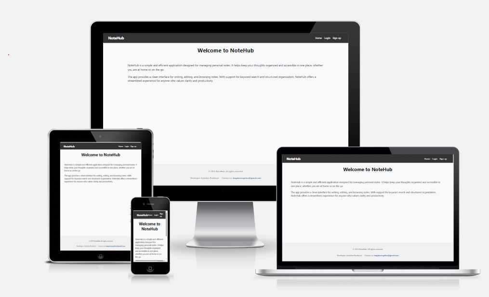
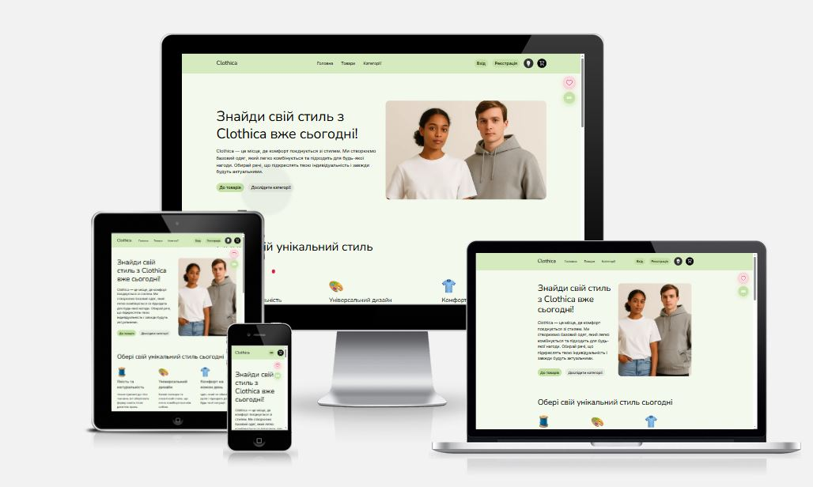
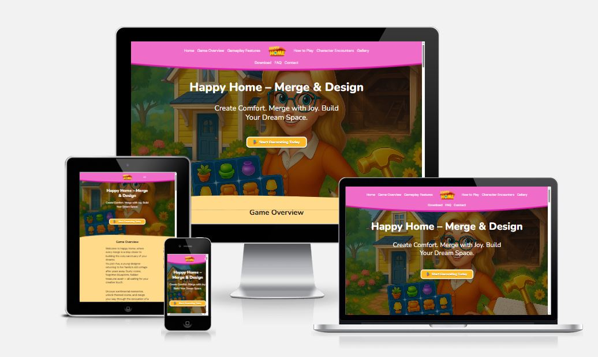

<h1 align="center">Hi, I'm Anhelina </h1>

  

  

---

## 👩‍💻 About Me

I’m a Junior Full Stack Developer with a strong foundation in both frontend and backend development — and a unique background in accounting that sharpened my precision and problem-solving mindset.

I enjoy building functional, clean, and user-friendly products using **React**, **Next.js**, **Node.js**, and modern tools.  
I'm continuously improving my skills and looking for opportunities to contribute, grow, and create meaningful digital experiences.

---

## 🛠 Tech Stack

### **Frontend**

### **Backend**

### **Tools**

---

## 📈 GitHub Stats

  
  

---

## 🚀 Projects

### 📌 **Note Hub** — Next.js • REST API • Auth

A secure note-taking application with authentication, protected routes, and full CRUD functionality.  
Focused on clean structure, reliable backend logic, and smooth user experience.
Role: Frontend Developer
🔗 https://github.com/Angelina-web/09-auth

  

---

### 📌 **Clothica Shop** — Next.js • Node.js • Zustand • React Query

A full e-commerce platform with dynamic catalog, filtering, form validation, theme switching, and UI animations.
Integrated backend API and built advanced state management for seamless user flow.
Role: Scrum Master + Frontend Developer
🔗 https://github.com/Angelina-web/clothica-shop

  

---

### 📌 **Book Shop** — HTML • CSS • JS

Developed a responsive online bookstore as a frontend developer.  
Implemented search, adaptive UI, and coordinated team workflow.
Role: Frontend Developer
🔗 https://github.com/Angelina-web/js-booksy-project-12

  

---

### 📌 **Game Website** — HTML • CSS • JavaScript

Interactive landing page with smooth animations and gamified UX.  
Responsible for UI/UX logic and core functionality.
Role: Team Lead + Frontend Developer
🔗 https://github.com/Angelina-web/stp-10193

  

---

### 📌 **Rent Yacht** — HTML • CSS • JavaScript

Modern landing page with booking form, adaptive layout, and polished UI.  
Focused on accessibility and clean visual structure.  
Role: Frontend Developer
🔗 https://github.com/Angelina-web/project-group17

  

---

### 📌 **WebStudio** — HTML • CSS • JavaScript

Corporate multipage site with consistent design, animations, and optimized layout.  
Improved code structure and UI quality.  
Role: Frontend Developer
🔗 https://github.com/Angelina-web/goit-markup-hw-06

  

---

✨ Thanks for visiting my GitHub! ✨

